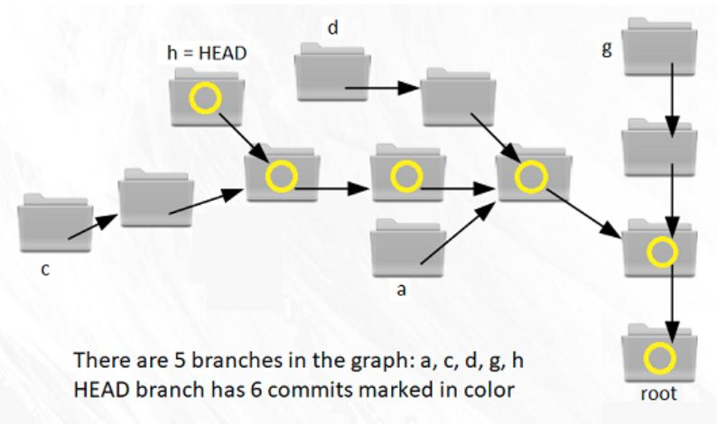

### GitObjects

The aim of this project is to access the objects in any Git repository from within Java.

The simplicity of Git design is strongly contrasted by the rich set of commands in the user interface. 

Every Git object has three pieces of information in common:
* Type: Commit, Tree, or Blob (=binary file) -- as explained below.
* SHA: serves as a content-dependent name
* Size: in bytes (uncompressed binary)

On top this basic information, Git objects carry other data. In order to access these objects from Java, there are three source files in this repository -- see [the API](https://maeyler.github.io/GitObjects/)

Start with `$ java -jar sss.jar` and click on `Menu.chooser()` and then on `Chooser.runTeacher()`

Select GitInspector.txt in the File dialog and then select Git.class -- Here is the explanation of the events:

We need a new Git instance in the current directory: `G = new Git()`

First, display all Branches in G:  `G.getAllBranches()`



There were 5 branches in our repo when this snapshot was taken. 

Find the HEAD of the current branch in G:  `h = G.currentHEAD()`

Display all Commits in this branch:  `h.printAllCommits()`  This branch has 21 commits toward to root.


Find the latest commit in h:  `c = h.getLatestCommit()`  This is a Git object of the first kind.

This object has all the information about the Commit: 
* what: human-readable name (need not be unique)
* who: the author (name and e-mail)
* when: time in msec and as date string
* contents: Tree reference (root directory)
* parent(s): 0, 1, or 2 Commit references


Load the tree of this Commit:  `t = c.getTree()`  This is a Git object of the second kind: Tree, a directory.

Get the first child in the tree:  `b = t.getChildAt(0)`  This is a Git object of the third kind: Blob, a file.

Tree and Blob objects carry the actual data. Name and parent of these objects were included in earlier versions, but they are meaningful only within a certain Commit, thus they are not part of the object data. Name is stored in the parent Tree, parent is not stored -- there is no backward reference in Git data.

Finally, make and display the tree in two steps:  `n = c.toTreeNode(); Menu.toTree(n);`


As a test case, you may look at [a simple CRM example](cust/customer.md).

### Version History

#### V0. GitObjects.java

It all started with [an excellent article](https://hackernoon.com/https-medium-com-zspajich-understanding-git-data-model-95eb16cc99f5) on .git/objects -- I had to try it myself!

Finding the objects and deflating the files was simple work. It worked fine in half a day, but the story is not so simple: Most Git objects are packed!


#### V1. GitInspector becomes Git.java

Rather than trying to unpack objects, Git should do the work -- use `java.lang.ProcessBuilder` 

**Usage:** Compile and run Git.java at the root of any Git repo

The output of the program on *this repo*, when it had only three commits:
```sh
$ java Git
88f4044ecf7f20aba666136072bd4f0132c28f0d
21/03/2018 17:18  GitObjects.java
tree 91ea30  4 items ***  parent e4f4d0
============================================================
21/03/2018 17:17  modify README
tree c9d0f5  2 items ***  parent 7bb2af
============================================================
21/03/2018 14:01  Initial commit
tree bcadff  1 items ***
============================================================
```

#### V2. verifiy() and saveTo(File)

We can verify every Blob within a Commit by calculating its SHA 

We can also save to the contents of each Commit into a given folder

#### V3. Objects are cached

Git objects are immutable -- Rather than calculating each object from scratch, we keep them in Map and avoid lengthy calculations

#### V4. TreeNode is separated from Git objects

TreeNode is a useful interface recognized by JTree, simplifying to display the contents of a given Commit.

In earlier versions, Git.Entry implements TreeNode. In V4, the two classes are separated.

#### V5. Use java objects instead of SHA

Converting Git objects to Java objects requires a recursive, top-down approach. But it is slow: In order to read the last Commit, you have to read the parents all the way to the initial commit. A hybrid approach was used: Initially SHA links are stored in each object, then the actual objects are made only when needed. (lazy evaluation)

### References

* Chap 10 in the Git Book: [Git Internals](https://git-scm.com/book/en/v2/Git-Internals-Plumbing-and-Porcelain)
* [Understanding Git  —  Data Model](https://hackernoon.com/https-medium-com-zspajich-understanding-git-data-model-95eb16cc99f5)
* [The Git Parable](http://tom.preston-werner.com/2009/05/19/the-git-parable.html) and [related images](https://practical-neuroimaging.github.io/_downloads/git_parable_johan_herland.pdf)

