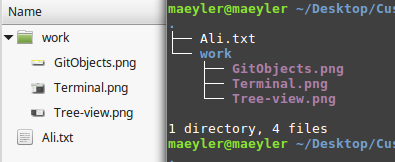
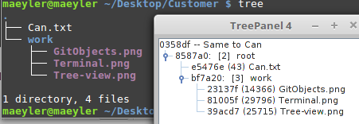

## Customer Relationship Using Git Branches

This example illustrates a simple CRM system using Git branches. We begin with two files in a folder: A letter to our customer (Ali.txt) and an attachment (work.png).

We have other customers (not too many, perhaps only 30) to whom similar letters will be sent. We decide to use Git for this purpose. (All the commands shown here could also be done using GitKraken with a GUI and nothing to memorize)
```
$ git init
$ git add .
$ git commit -m "Letter to Ali"
```
Three lines are enough to start Git with the first commit which contains the two files already in that folder. Nothing in the background, no user interface -- Just simple Git commands.

### 1. Ali

Let us make a new branch with the customer name and delete the default branch, as "master" is quite meaningless in this context: (GitKraken has a simpler way to rename branches)
```
$ git checkout -b Ali
$ git branch -d master 
```

### 2. Alice

A similar letter will go to the next customer with two attachments. Make a new branch for Alice and a work folder for the attachments:
```
$ git checkout -b Alice
$ mkdir work
$ mv work.png work/Terminal.png
```
We modify the letter `Ali.txt --> Alice.txt` and add another file into the work folder. Ready for the second commit with three files now:
```
$ git add .
$ git commit -m "Write to Alice"
```

### 3. Bob

We will send the same work to the next customer.
```
$ git checkout -b Bob
```
The letter must be modified once again: `Alice.txt --> Bob.txt`
```
$ git add .
$ git commit -m "Same to Bob"
```

### 1b. Back to Ali

Time has passed and we need to update the first customer. Now we have three attachments... No need to do the same work again. Just checkout the first branch and copy the work from the second:
```
$ git checkout Ali
$ git reset Alice --hard
```
Don't forget to modify Ali.txt and add another file to the work. Here comes another commit to the first customer:
```
$ git add .
$ git commit -m "Modify Ali"
```

### 4. Can

Our last customer in this example will receive the same set of files. Just make a new branch, modify `Ali.txt --> Can.txt`, and do the commit:
```
$ git checkout -b Can
$ git add .
$ git commit -m "Same to Can"
```

### Summary

Now we have 5 commits in 4 branches. We can see all the branches and all the commits in the current branch with two simple commands:
```sh
$ git branch -v
  Ali   d7fc7c3 Modify Ali
  Alice 83e99f2 Write to Alice
  Bob   6bc8fe6 Same to Bob
* Can   9b87f3e Same to Can

$ git log --oneline
9b87f3e Same to Can
d7fc7c3 Modify Ali
83e99f2 Write to Alice
a134124 Letter to Ali
```
The result of this much work can be found in [customer.txt](customer.txt) and also in the repository https://github.com/maeyler/Customer

Here are the images used above as attachments:

1. The contents of a commit as files:


2. All commits in the repo using GitObjects:


3. The contents of a commit as a tree:


